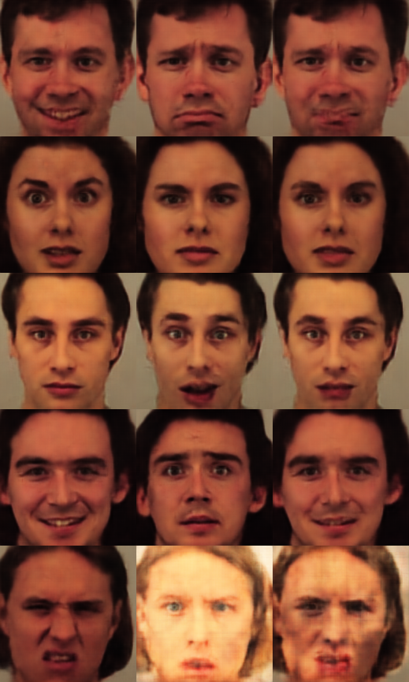

# Adversarial-CAE Face Synthesize Application

Adversarial-CAE  is a good framework for face synthesize and data arguement. It has been originally introduced in this research `GCN`[article](https://arxiv.org/abs/1705.02887) & `Pix2Pix`
[article](https://arxiv.org/pdf/1611.07004v1.pdf)
This repository contains a tensorflow implementation of Adversarial-CAE.

## Dependences

* [tensorflow](https://www.tensorflow.org/)
* [openface](https://github.com/cmusatyalab/openface)

## Demo

We used two kinds of datasets, self dataset and [KDEF](http://www.emotionlab.se/resources/kdef)
For the first time to run, you should prepare data first, run command:
```bash
python main.py \
	--generate_data \
	--dataset_dir DATASET_DIR \
```
It will generate data from dataset directory, and if you want to use extra data/two dataset
```bash
python main.py \
	--generate_data \
	--use_extra_data \
	--dataset_dir DATASET_DIR \
	--extra_data_dir EXTRA_DATA_DIR
```
If your self dataset's quality is not so good, you can perform face alignment to your own dataset, just add params
```bash
--face_align
```
When second run main.py, maybe data file is exist, please remove params
```bash
--generate_data
```
At the test/sample time, you just need run
```bash
python main.py --sampling
```

## Examples
### 1st/2nd ground true label(appear in training set)==>3rd synthesized emotion(new emotion)

### 1st/2nd ground true label(not appear in training set)==>3rd synthesized emotion(new emotion)


